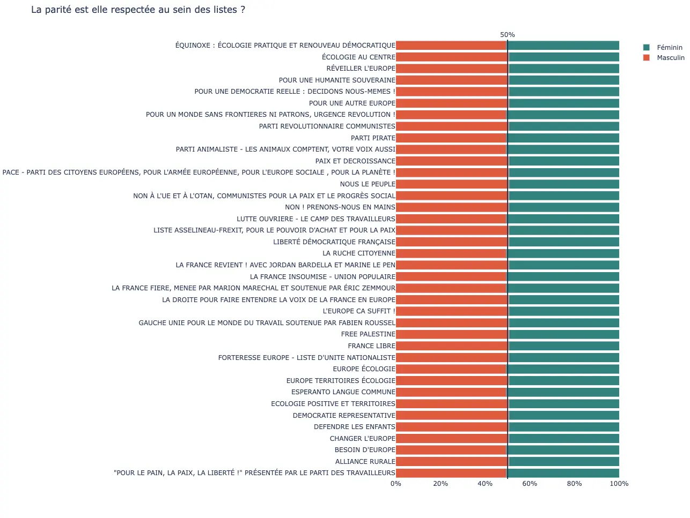

# Projet Open Data - Élections Européennes 2024

Bienvenue sur notre projet concernant les Élections Européennes 2024 ! Ce projet a pour but de centraliser et partager des informations sur les listes électorales, les candidats, leurs sites web et leurs programmes concernant le numérique. 
Nous souhaitons encourager la transparence et faciliter l'analyse des propositions des candidats sur les sujets technologiques.

## Contenu du projet

- **Listes électorales et candidats** : Informations détaillées sur les listes participantes et leurs membres.
  - [candidats-eur-2024.csv](data%2Fraw%2Fcandidats-eur-2024.csv)
- **Sites web officiels** : Analyse et référencement des sites web des listes et candidats
  - Version plus visuelle : https://les-enovateurs.github.io/dashlord/
  - Version simple à comprendre : [program-accessibilite-rgpd-ecoindex.json](data%2Fcomplete%2Fprogram-accessibilite-rgpd-ecoindex.json)
  - Version complète mais plus complexe : [program-with-dashlord.json](data%2Fcomplete%2Fprogram-with-dashlord.json)
- **Programmes numériques** : Détails des propositions concernant le numérique, l'IA, la cybersécurité, et plus encore.
  - [listes.yml](data%2Fnumerique-programme%2Flistes.yml)
## Comment contribuer

Nous sommes ouverts à toutes les contributions ! Vous pouvez nous aider en :
- Ajoutant de nouvelles données ou en mettant à jour les informations existantes.
- Créant des visualisations de données et des graphiques pour mieux comprendre les tendances et les propositions.
- Partageant le projet sur vos réseaux sociaux pour augmenter notre visibilité.

## Exemple de visualisation

## Citations et remerciements

Merci de citer le projet et l'association Les Enovateurs dans vos communications si vous utilisez nos données. Cela nous aide à continuer à fournir des informations précieuses et à maintenir ce projet.

## Licence

Ce projet est sous licence [GPL-3.0](LICENSE).

## Rejoignez-nous

- **GitHub** : [Les Enovateurs](https://github.com/les-enovateurs/elections-europeennes)
- **Le média du numérique responsable, éthique et inclusif - Site web** : [les-enovateurs.com](https://les-enovateurs.com)

---

Partagez ce projet et contribuez à une meilleure compréhension des enjeux numériques des Élections Européennes 2024 !

---